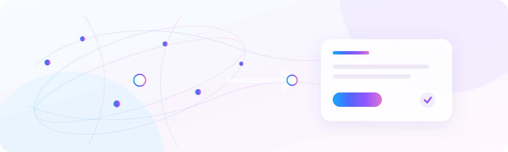
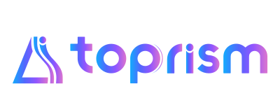
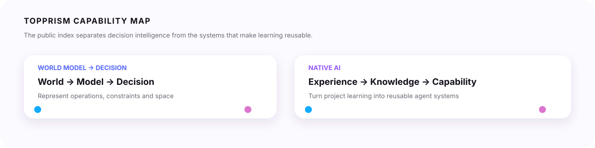

<p align="center">
  <picture>
    <source media="(prefers-color-scheme: dark)" srcset="assets/brand/profile-hero-dark.svg">
    
  </picture>
</p>

<p align="center">
  <picture>
    <source media="(prefers-color-scheme: dark)" srcset="assets/brand/topprism-wordmark-light.svg">
    
  </picture>
</p>

<h1 align="center">TopPrism</h1>

<p align="center">
  <strong>Decision intelligence for the physical business world.</strong><br>
  We build World Models that become decisions—and Native AI systems that turn experience into reusable organizational capability.
</p>

<p align="center">
  <a href="#world-model--decision"></a>
  <a href="#native-ai"></a>
  <a href="PORTFOLIO.md"></a>
</p>

<p align="center"><em>Our public repositories are an evidence layer—not a claim that every experiment is a product.</em></p>

<p align="center"><a href="README.zh-CN.md">中文</a> · <a href="PORTFOLIO.md">Full portfolio</a> · <a href="https://www.topprismdata.com/">Company site</a></p>



## Why TopPrism

AI systems increasingly act on enterprise knowledge. Finding a relevant document is not enough: the system also needs to know where a statement came from, whether it is current, how it relates to other entities, and what remains uncertain.

TopPrism treats knowledge as a governed, evolving layer between enterprise reality and AI agents:

```text
Enterprise reality → evidence → governed knowledge → agent context → decision or action
```

The profile uses the same principle at the portfolio level: every repository is labeled by purpose, maturity and evidence so technical work is not mistaken for a customer deployment or a commercial claim.

<!-- GENERATED:FLAGSHIPS:START -->
## World Model → Decision

Model the physical business world, then turn states, constraints and objectives into decisions.

```text
Business world → world model → constraints & objectives → decision engine → feedback
```

<table>
<tr>
<td width="50%"><strong><a href="https://github.com/topprismdata/visit-scheduling-optimizer">visit-scheduling-optimizer</a></strong><br>
<sub>Data-calibrated decision engine for recurring field-sales visit scheduling.</sub><br><br>`customer decision` · `applied` · `anonymized operational data`</td>
<td width="50%">&nbsp;</td>
</tr>
</table>

## Native AI

Turn project experience into knowledge, reusable skills and stronger agents.

```text
Project → experience → knowledge → reusable skill → stronger agent
```

<table>
<tr>
<td width="50%"><strong><a href="https://github.com/topprismdata/three-layer-wisdom-extraction">three-layer-wisdom-extraction</a></strong><br>
<sub>Promote project events into domain knowledge and transferable principles.</sub><br><br>`native ai` · `framework` · `internal evaluation`</td>
<td width="50%"><strong><a href="https://github.com/topprismdata/topprismwiki">topprismwiki</a></strong><br>
<sub>Evidence-governed knowledge infrastructure for enterprise AI agents.</sub><br><br>`native ai` · `framework` · `internal evaluation`</td>
</tr>
</table>
<!-- GENERATED:FLAGSHIPS:END -->

Featured projects are maintained in the versioned [portfolio registry](portfolio/portfolio.yml). A project becomes featured only through explicit review; stars, activity or recency never promote it automatically. The selected set can change as the work evolves.

## The evidence standard

We separate three dimensions in every original repository:

| Dimension | What it answers |
| --- | --- |
| Purpose | What kind of problem is this work intended to address? |
| Maturity | Is it a research project, framework, applied engine, utility or reference? |
| Evidence | What kind of data, evaluation or operational basis supports the current description? |

This keeps an anonymized operational study distinct from production deployment, an internal evaluation distinct from an external benchmark, and an upstream fork distinct from an original TopPrism capability.

## Explore the portfolio

The complete catalog—including decision science, Native AI, learning projects and upstream references—is maintained separately in the [full portfolio](PORTFOLIO.md). The [Chinese mirror](README.zh-CN.md) and [中文 portfolio](PORTFOLIO.zh-CN.md) are maintained from the same approved registry.

## Contact

TopPrism Data

Public company site: [topprismdata.com](https://www.topprismdata.com/)

For engineering and GitHub matters, use the company contact channel rather than personal addresses.

## License

The contents of this profile repository are released under the MIT License — see [`LICENSE`](LICENSE).
